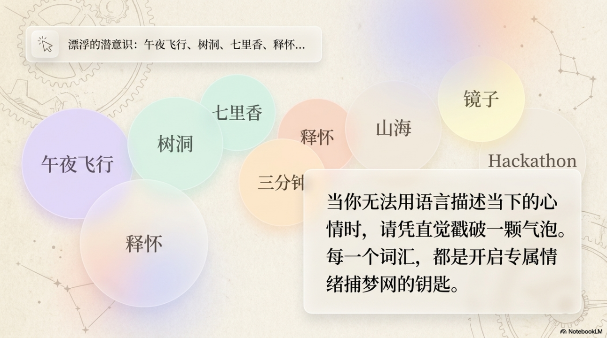

🎵 项目概览  
产品名称：「回响」(Echo)  
产品定位：兼具 “实用扒谱引擎” 与 “音乐情绪盲盒” 的灵感交互空间，打造面向全平台音乐创作者的内容交流生态圈。  
Slogan：每一段邂逅的旋律，都应该有回响。

---

📊 市场洞察与需求背景
🌍 庞大的用户基础

- 全球覆盖：截至 2026 年初，TikTok 全球月活用户突破 19 亿，日均使用时长高达 95 分钟
- 音乐发现：75% 的用户通过短视频平台发现新歌，抖音已成为全球最大的音乐发现渠道
- 创作者规模：平台聚集了 570 万音乐创作者、110 万翻唱作者、55 万认证音乐人，且以年复合增长率 44% 持续增长
⚠️ 行业痛点与未满足需求
当前音乐创作者面临三大核心困境：

1. 交流渠道碎片化

现有平台侧重内容分发，缺乏专门的创作者协作工具，570 万创作者仍是孤立的内容生产者

1. 技术支持严重不足

仅 20% 创作者能获得平台技术指导，AI 音乐创作工具普及率极低，85% 创作者迫切需要编曲、混音、AI 工具的技术交流

1. 社交与成长缺失

65% 创作者希望拓展跨地域、跨风格的合作人脉，但缺乏有效的连接渠道
震撼定位：在全球超十亿音乐受众与数百万创作者之间，我们正在搭建一个跨越平台、链接创作、协作与成长的音乐人生态圈，让每一份才华都被看见、被连接、被成就。

---

💡 核心设计理念
音乐分为两种，一种是你想用双手掌控的（技能向），一种是你想用心灵触碰的（情绪向）。
基于这一洞察，我们将产品主界面极简地划分为两个核心入口，同时满足用户对音乐的双重探索欲：

- 「拾音」：扒谱与练习的硬核工具舱，解决技能提升需求
- 「声境」：童话视觉的情绪与社交自留地，满足情感连接需求
两个模块互不干扰，又在审美上高度统一，构成了一个完整、高级且具有极强成瘾性的音乐元宇宙。

---

🛠️ 功能模块设计

---

🔊 拾音 (Transcription)
定位：将公域流量（短视频）转化为私有音乐资产的转化器
UI 氛围：专业、极简、暗调，强调工具的高效感
核心功能流：

1. 抖音视频链接解析

从歌曲到纯净旋律的一键转化，AI 智能解析为动态乐谱，支持抖音 / B 站等全平台视频链接

2. 5+1 音轨精准剥离

Pick 你最爱的乐器：钢琴、吉他、贝斯、架子鼓、其他乐器、纯人声，精准分离每一条音轨

3. 动态乐谱生成

生成可跟随光标滚动的动态乐谱，支持五线谱 / 简谱 / 六线谱自由切换

4. 高光分享，社交裂变

选取乐谱片段，搭配个人演奏，生成 “图像 + 歌词 + 波形” 卡片，一键分享到社交平台，实现内容的病毒式传播

---

✨ 声境 (Mystery)
定位：产品的灵魂所在，主打感性体验、随机性惊喜与轻量级音乐社交
主视觉：动态微风中的童话园地，两只充满灵性的动物（猫与马）作为交互入口
交互 A：点击小猫 —— 灵感缪斯 (Muse)
猫是敏感的情绪捕捉者，它为你叼来今天的命运音符

1. 情绪捕梦网

屏幕漂浮色彩斑斓的词汇气泡（午夜飞行、执念、释怀、白日梦...），戳破符合当下心境的气泡

2. 命运卡牌抽选

78 张带有神秘音乐学符号的卡牌空中洗牌，凭直觉抽取 3 张专属命运牌

3. AI 神谕降临

生成专属 “今日音乐盲盒卡”，包含关键词解读文案 + AI 生成的专属氛围旋律

4. 私藏或分享

听完旋律，可选择私藏入库，或分享至 Matrix 广场与他人共振

交互 B：点击小马 —— Matrix 音乐盲盒广场
马代表旅途与相遇，带你进入广袤的旷野，与陌生人的回音相撞

1. 像刷 Dating App 一样邂逅音乐

摒弃传统瀑布流，采用沉浸式卡片滑动交互，每条内容都封装在复古磁带、黑胶、漂流瓶等盲盒物品中
2. 极简上瘾的手势操作

- 左滑：感觉不对，丢弃
- 右滑：频率共振，自动收藏
- 双击：爆出发光音符，点赞支持
- 下滑：切换下一个盲盒

1. 灵魂共振的「合奏」机制

听到喜欢的音轨可点击「合奏」按钮，直接录制自己的乐器或人声，生成多人共创的新作品，再次投入广场循环

---

🔄 产品体验闭环
在这套设计中，用户的心智旅程变得极其清晰且极具粘性：
场景
操作路径
价值
想练琴 / 想分享
打开【拾音】→ 丢个链接 → 提取乐器谱 → 截取最帅片段 → 发抖音
技能提升 + 社交炫耀
emo 了 / 需要情绪价值
打开【声境】→ 点猫咪 → 选情绪气泡 → 抽命运牌 → 听 AI 专属旋律
情绪治愈 + 灵感获取
无聊 / 想玩音乐
点白马进入【Matrix】→ 刷盲盒磁带 → 听到绝美清唱 → 点击【合奏】→ 共创作品
社交连接 + 内容共创

---

🌱 生态价值与未来展望
商业价值
音乐创作者经济规模已超 500 亿美元，平台可通过增值服务实现盈利，同时激活整个音乐生态的商业潜力
生态愿景
我们相信，每一段旋律都不该是孤独的。通过 Echo，我们希望：

- 让技术赋能创作，降低音乐创作的门槛
- 让连接打破孤岛，让全球音乐人找到同频的伙伴
- 让灵感不再稀缺，让每一份情绪都能找到专属的音乐回响

---

团队：四重奏小组成员：蔡子淇、林可、徐晓、刘雨宁
日期：2026 年 4 月
项目附件
介绍PPT
暂时无法在飞书文档外展示此内容
团队合影

